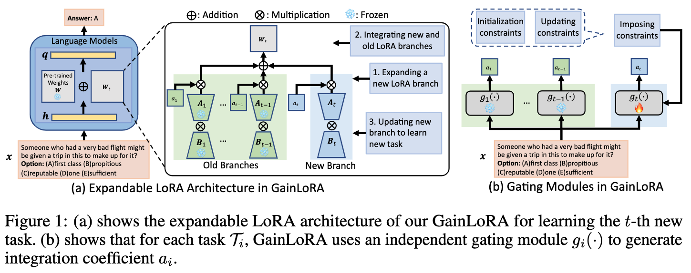

# GainLoRA: Gated Integration of Low-Rank Adaptation for Continual Learning of Large Language Models

> This is the official implementation of our NeurIPS 2025 paper "Gated Integration of Low-Rank Adaptation for Continual Learning of Large Language Models". 

## Introduction

Continual learning (CL), which requires the model to learn multiple tasks sequentially, is crucial for large language models(LLMs). Recently, low-rank adaptation (LoRA), one of the most representative parameter-efficient fine-tuning (PEFT) methods, has gained increasing attention in CL of LMs. However, most existing CL methods based on LoRA typically expand a new LoRA branch to learn each new task and force the new and old LoRA branches to contribute equally to old tasks, potentially leading to forgetting. In this work, we propose a new method, called gated integration of low-rank adaptation (GainLoRA), for CL of LLMs. GainLoRA expands a new LoRA branch for each new task and introduces gating modules to integrate the new and old LoRA branches. Furthermore, GainLoRA leverages the new gating module to minimize the contribution from the new LoRA branch to old tasks, effectively mitigating forgetting and improving the model's overall performance. Experimental results on CL benchmarks demonstrate that GainLoRA outperforms existing state-of-the-art methods. 



## Requirements
* python 3.10.12
* pytorch 2.1.0
* transformers 4.30.2
* Datasets 2.14.6
* CUDA 12.1
* cupy 12.1.0
* deepspeed 0.11.2
* accelerate 0.24.1
* numpy 1.22.4

## Runing

### T5 Experiments

#### GainLoRA with InfLoRA
```
bash gen_script_superni_order1_t5_gainlora_inflora.sh your_device_id model_path_for_t5_large
bash gen_script_superni_order2_t5_gainlora_inflora.sh your_device_id model_path_for_t5_large
```
#### InfLoRA
```
bash gen_script_superni_order1_t5_inflora.sh your_device_id model_path_for_t5_large
bash gen_script_superni_order2_t5_inflora.sh your_device_id model_path_for_t5_large
```

#### GainLoRA with OLoRA
```
bash gen_script_superni_order1_t5_gainlora_olora.sh your_device_id model_path_for_t5_large
bash gen_script_superni_order2_t5_gainlora_olora.sh your_device_id model_path_for_t5_large
```
#### OLoRA
```
bash gen_script_superni_order1_t5_olora.sh your_device_id model_path_for_t5_large
bash gen_script_superni_order2_t5_olora.sh your_device_id model_path_for_t5_large
```

### Llama-2-7B Experiments

#### GainLoRA with InfLoRA
```
bash gen_script_superni_order1_llama_gainlora_inflora.sh your_device_id model_path_for_llama2_7b
bash gen_script_superni_order2_llama_gainlora_inflora.sh your_device_id model_path_for_llama2_7b
```
#### InfLoRA
```
bash gen_script_superni_order1_llama_inflora.sh your_device_id model_path_for_llama2_7b
bash gen_script_superni_order2_llama_inflora.sh your_device_id model_path_for_llama2_7b
```

#### GainLoRA with O-LoRA
```
bash gen_script_superni_order1_llama_gainlora_olora.sh your_device_id model_path_for_llama2_7b
bash gen_script_superni_order2_llama_gainlora_olora.sh your_device_id model_path_for_llama2_7b
```

## Acknoledgements
The code of this repository partly relies on the following two repositories:
- [SAPT](https://github.com/circle-hit/SAPT)
- [O-LORA](https://github.com/cmnfriend/O-LoRA)